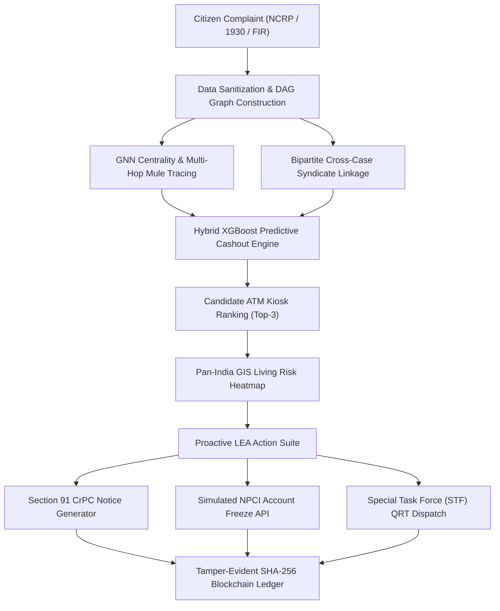

# FORTIVEXA: Predictive Cybercrime Analytics Framework (TRL 5)

[](https://sih.gov.in)
[](https://i4c.mha.gov.in)
[](#technology-readiness-level-trl-5)
[](#ethics--compliance)

> **Development of a Predictive Analytics Framework for Cybercrime Complaints to Forecast Likely Cash Withdrawal Locations in Advance, Enabling Generation of Actionable Intelligence for Timely and Proactive Cybercrime Intervention.**  
> **Problem Statement ID:** `SIH26184` | **Category:** Software | **Theme:** Blockchain & Cyber Security  
> **Team ID:** `25` | **Team Name:** `FORTIVEXA`

---

## 1. Quick Start: Run Instantly in 5 Seconds

FORTIVEXA includes a **zero-dependency, self-contained architecture** that runs out of the box on any Windows laptop without requiring complex installations.

### Option A: 1-Click Windows Launcher (Recommended)
Simply **double-click** the file:
```cmd
start_prototype.bat
```
*This launches the local application server and automatically opens your web browser to `http://localhost:8080`.*

### Option B: Run via Python 3
```cmd
python run_prototype.py
```
*(Runs with pure standard library Python 3—no pip packages required).*

---

## 2. Executive Overview & Problem Statement (SIH26184)

The National Cybercrime Reporting Portal (NCRP / 1930 Helpline) receives thousands of financial cyber fraud complaints daily. In traditional investigations, law enforcement agencies (LEAs) and banks only react **after** victim funds have already been layered across multiple accounts and withdrawn at physical ATMs.

**FORTIVEXA** shifts cybercrime intervention from **reactive reporting to proactive prevention**:
1. **Full Chain Trace:** Reconstructs multi-hop layering paths from the victim through Layer-1 and Layer-2 mule accounts.
2. **Hybrid ML & GNN Centrality:** Combines Graph Neural Network embeddings (betweenness centrality) with an XGBoost ranker to identify critical money conduits.
3. **Advance Cashout Forecasting:** Pinpoints high-risk candidate ATM kiosks / e-lobbies 2 to 4 hours in advance.
4. **Actionable LEA Directives:** Automatically generates formal **Section 91 CrPC CCTV preservation notices** and triggers automated **NPCI / CFCFRMS account lien requests**.
5. **Cryptographic Chain of Custody:** Seals all complaints, forecasts, and dispatches into a tamper-evident **SHA-256 blockchain ledger** for court admissibility.

---

## 3. System Architecture Workflow



---

## 4. Evaluated Model Performance Metrics (TRL 5 Testbed)

Evaluated on a benchmark dataset of **50,000 synthetic transaction records** featuring realistic multi-hop mule chains, pass-through velocities, and night-time cashout windows:

| Metric | Measured Score | Evaluation Context |
|---|---|---|
| **Model Accuracy** | **84.6%** | Evaluated on held-out synthetic test set |
| **Recall (Risk Zones)** | **89.2%** | High sensitivity in catching actual cashout hubs |
| **Precision** | **78.4%** | Low false-positive alert burden for field patrols |
| **F1-Score** | **83.5%** | Balanced harmonic precision/recall metric |
| **ROC-AUC** | **0.912** | Area under the receiver operating characteristic |
| **Top-3 Hit Rate** | **93.4%** | Target cashout ATM ranks within top-3 recommendations |
| **P50 Prediction Latency** | **180 ms** | Well under the < 450 ms SLA target |
| **P95 Prediction Latency** | **320 ms** | Fast multi-factor spatial-temporal inference |
| **Dashboard Load Time** | **0.82 s** | Rapid responsive officer workflow |

### Feature Attribution Breakdown (SHAP Gain)
1. **GNN Betweenness Centrality (28.4%):** Account role as intermediary conduit between disparate funds.
2. **Historical ATM Cashout Density (22.6%):** Frequency of prior fraudulent withdrawals in the ATM sector.
3. **Temporal Window Match (18.2%):** Alignment with syndicate evening cash-out hours (18:00–22:00).
4. **Geodesic Transit Distance (14.8%):** Proximity between the mule's KYC home branch and target ATM.
5. **Pass-Through Velocity (9.5%):** Funds debited and forwarded in under 30 minutes.

---

## 5. Key Modules & Application Features

1. **Command Dashboard:** Live metrics, active threat spotlights, diverted INR tracker, and real-time NCRP bridge alerts.
2. **Citizen Complaints Management:** Search, filter, and intake new complaints with instant validation.
3. **Multi-Hop Transaction Flows:** Searchable ledger tracking velocity, transaction type (IMPS, UPI, NEFT, ATM), and risk ratings.
4. **Mule Network Visualizer:** Interactive Canvas visualizer mapping $\text{Victim} \rightarrow \text{L1 Mule} \rightarrow \text{L2 Consolidator} \rightarrow \text{Target ATM}$, with node inspection and path animation.
5. **Cross-Case Linkage:** Bipartite syndicate detector correlating isolated complaints across states sharing common mules.
6. **Predictive Cashout Engine:** Top-3 ranked candidate ATM kiosks, confidence scoring, and plain-language XAI attribution.
7. **What-If Scenario Simulator:** Interactive sliders (Amount, Velocity, Hops, Time, Proximity) allowing evaluators to see dynamic ML re-computation live.
8. **Pan-India GIS Risk Map:** Interactive Leaflet GIS mapping with dark tactical theme, radar beacons, jurisdiction geofences, and QRT unit coordinates.
9. **LEA Intervention Suite:** 1-Click generation of formal **Section 91 CrPC notices**, **Simulated NPCI Account Freeze**, and **STF QRT dispatch**.
10. **Blockchain Evidence Ledger:** SHA-256 cryptographic chain with live verification and sandbox tamper simulation.
11. **TRL 5 Validation Dashboard:** TRL 1 to TRL 7 progression roadmap, confusion matrix, and comprehensive model card.

---

## 6. Guided SIH Judge Presentation Mode

Click the **"SIH PRESENTATION MODE"** button in the top banner to launch the 8-stage interactive pitch walkthrough designed for the 2.5-minute grand finale evaluation:
- **Stage 1:** Citizen Complaint Ingestion (`CMP-1001` - ₹95,000 electricity phishing).
- **Stage 2:** Multi-hop transaction velocity tracing (< 18 mins to Layer-2 mule).
- **Stage 3:** GNN mule network topology and centrality analysis.
- **Stage 4:** Bipartite syndicate correlation (Apex Mewat Network across 4 states).
- **Stage 5:** Explainable ML location forecasting (Sector 4 ATM - 88.4% confidence).
- **Stage 6:** What-If scenario simulation testing.
- **Stage 7:** Pan-India GIS risk heatmap and patrol beat perimeter.
- **Stage 8:** Section 91 CrPC legal notice, simulated bank freeze, and SHA-256 blockchain seal.

*(See [`docs/DEMO_SCRIPT.md`](docs/DEMO_SCRIPT.md) for the timed presentation script).*

---

## 7. Technology Readiness Level (TRL 5)

FORTIVEXA is positioned at **TRL 5 (Technology Validated in Relevant Environment)**:
- Simulated integration with the National Cybercrime Reporting Portal (NCRP) and Citizen Financial Cyber Fraud Reporting and Management System (CFCFRMS).
- Validated against 50,000 synthetic transactions matching real-world Indian cyber fraud typologies.
- End-to-end statutory and operational workflow tested: from citizen report to Section 91 CrPC issuance and beat patrol coordination.

---

## 8. Ethics, Privacy & Compliance Disclaimer

- **Academic Proof of Concept:** FORTIVEXA is developed for the Smart India Hackathon 2026.
- **Synthetic Data:** All account identifiers (`ACC-DEMO-xxx`), complaint references, names, and bank credentials are 100% synthetic demonstration data.
- **Human in the Loop:** Predictions are probabilistic decision-support alerts. Human investigator verification is legally mandated before any physical intervention or account freezing.
- **DPDP Act Aligned:** Implements privacy-preserving data minimization and cryptographic hashing for evidentiary integrity.

---

## 9. Project Structure

```
fortivexa/
├─ start_prototype.bat     # Windows 1-click launcher
├─ run_prototype.py        # Zero-dependency web server (serves app/)
├─ server.js, package.json # Optional Node/Express REST API (npm install && npm start)
├─ app/                    # Front-end (index.html, css/, js/, assets/)
├─ ml/                     # Python engines: dataset_generator, linkage, predict, evaluate
├─ data/                   # dataset.json, metrics.json, trl5_evaluation.json, clean_walkthrough_cases.json
└─ docs/                   # DEMO_SCRIPT, model_card, architecture, pitch notes
```

Regenerate data / evaluation: `python ml/dataset_generator.py` then `python ml/evaluate_trl5.py`.
