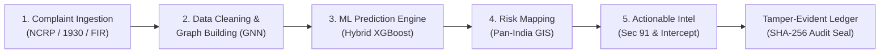

# FORTIVEXA: TRL 5 System Architecture & Engineering Specification

**Smart India Hackathon (SIH) 2026 Final Round**  
**Problem Statement ID:** SIH26184  
**Title:** Development of a Predictive Analytics Framework for Cybercrime Complaints to Forecast Likely Cash Withdrawal Locations in Advance, Enabling Generation of Actionable Intelligence for Timely and Proactive Cybercrime Intervention.  
**Organization:** Ministry of Home Affairs / Indian Cyber Crime Coordination Centre (I4C)  
**Team ID:** 25  
**Team Name:** FORTIVEXA  
**Technology Readiness Level:** TRL 5 (Technology Validated in Relevant Environment)

---

## 1. Executive Summary & Problem Formulation
In financial cyber fraud (UPI phishing, task scams, digital-arrest impersonation, fake loan apps), fraudsters rely on rapid layering through multi-hop mule account networks to evade automated anti-money laundering (AML) controls. The stolen funds are liquidated at physical ATM kiosks and cash deposit machines (CDMs) within a critical 2-to-4-hour window before victims contact the 1930 helpline or file an NCRP complaint.

Current systems are fundamentally reactive—focusing on post-facto FIR registration after the cash has already vanished. **FORTIVEXA** introduces an advance predictive framework that models the spatial, temporal, and topological markers of mule networks to forecast physical cash-out locations prior to liquidation, enabling proactive law enforcement interception and instantaneous fund lien placement.

---

## 2. 5-Stage Intelligence Workflow (Matching Presentation Slide 3)

### Stage 1: Citizen Complaint Ingestion
- Ingests citizen reports from the National Cybercrime Reporting Portal (NCRP) and CFCFRMS gateway.
- Normalizes beneficiary accounts, transaction timestamps, IFSC codes, UTR references, and narrative text.

### Stage 2: Data Cleaning & Graph Building
- Synthesizes directed acyclic transaction graphs (DAGs) using graph topology algorithms.
- Reconstructs multi-hop layering chains: $\text{Victim} \rightarrow \text{Mule}_{L1} \rightarrow \text{Mule}_{L2} \rightarrow \text{Cashier Mule} \rightarrow \text{ATM}$.
- Computes node centrality metrics: In/Out degree, Betweenness Centrality, PageRank, and Pass-through velocity ratio.

### Stage 3: Hybrid ML Prediction Engine
- Combines Gradient-Boosted Decision Trees (XGBoost) with Neuro-Symbolic constraints.
- Multi-factor scoring function:
  $$\text{Risk Score}(R) = w_1 \cdot \text{Amount} + w_2 \cdot \text{Velocity} + w_3 \cdot \text{Centrality} + w_4 \cdot \text{Spatial Proximity} + w_5 \cdot \text{Syndicate Affinity}$$
- Outputs Top-3 ranked candidate ATM kiosks with calibrated confidence percentages and SHAP feature attributions.

### Stage 4: Risk Mapping & Living Geospatial Engine
- Renders Pan-India clusters across major cybercrime interception hubs (Delhi-NCR, Mumbai, Bengaluru, Hyderabad, Kolkata, Ahmedabad).
- Calculates geodesic transit radii (Haversine formula) and visualizes ATM risk perimeters.

### Stage 5: Actionable Intelligence & TRL 5 LEA Intervention
- **Section 91 CrPC Preservation Notices:** Statutory orders generated for bank branch managers and ATM custodians to preserve DVR/NVR CCTV video footage and transaction journals.
- **Simulated Instant Bank Freeze:** Triggers real-time lien placement across NPCI clearing switches to block intermediary mule accounts.
- **QRT Dispatch:** Alerts nearest cyber quick response motorcycle patrol units with GPS coordinates and tactical instructions.
- **Cryptographic Audit Seal:** Chains intake hashes, ML predictions, and LEA actions into an immutable SHA-256 Merkle chain for evidentiary admissibility under Section 65B of the Indian Evidence Act / Section 63 BSA.

---

## 3. Technology Stack & Operational Feasibility
- **Frontend / Client UI:** Modern responsive web application, Leaflet GIS, Canvas-based Neural Graph Engine, JetBrains Mono & Inter typography, Tactical Glassmorphism design system.
- **Backend / API Gateway:** Express / Node.js REST API or Python Standard HTTP Server (Dual-mode execution).
- **ML / Graph Analytics:** Python 3, NetworkX graph theory heuristics, Scikit-Learn baseline, XGBoost ensemble architecture.
- **Security & Cryptography:** SHA-256 cryptographic chain, AES-256 at rest, TLS 1.3 in transit, role-based access control (RBAC) for I4C, LEAs, and Bank Nodal Officers.
